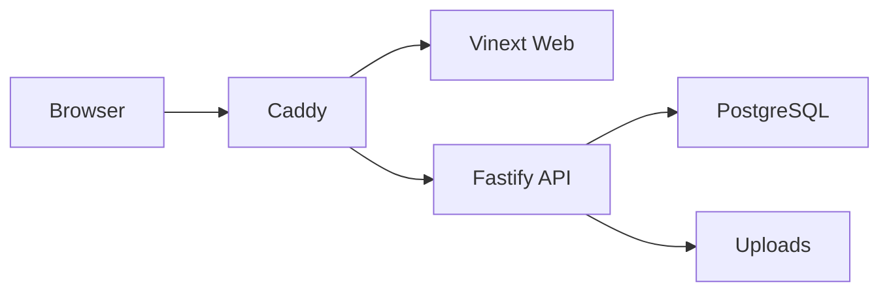

# Mozelle Journal

一个围绕电子、硬件、超频实验与次元收藏展开的个人博客。网站以伊蕾娜与 Mon3tr / 罗德岛为双主题视觉线索，在保持高帧率和低性能开销的前提下，加入语言重组、主题扩散、粒子标识、法阵流光与滚动维度场景等交互效果。

**在线访问：** [www.mozelle.top](https://www.mozelle.top)

## 主要功能

- 白昼与夜间双主题，带有从切换按钮向全屏扩散的过渡动画
- 中英双语界面，文字通过分解、溃散和重组完成语言切换
- 双主题指针、轻量尾迹、全局点击反馈和滚动驱动的场景变化
- 响应式布局，为宽屏、笔记本与移动端分别调整视觉密度和动画强度
- 独立文章详情页、Markdown 渲染、图片灯箱与正确的媒体显示比例
- 独立管理后台，支持草稿、发布、定时发布、分类、标签、双语内容和图库管理
- 后台访问统计，展示浏览量、独立 IP、访问趋势、热门页面，以及最近 IP 对应的所在地区与访问路径
- 文章修订记录、图片元数据清理以及服务端登录限速
- PostgreSQL 持久化、Docker Compose 编排和 Caddy 自动 HTTPS

## 技术架构

| 层级 | 技术 |
| --- | --- |
| 页面与交互 | React 19、Vinext、Vite 8、TypeScript |
| 服务端 API | Fastify 5、Node.js 22 |
| 数据与内容 | PostgreSQL 17、Drizzle ORM |
| 部署 | Docker Compose、Caddy |
| 样式与动效 | CSS 动画、Canvas、按需启用的 GPU 合成 |



## 仓库内容边界

公开仓库只保存网站代码和内容管理能力，不包含正式文章正文、文章图片、后台密码、数据库密码或服务器配置。生产内容由 PostgreSQL 和后台管理系统维护；克隆仓库后，文章列表为空属于正常状态。

所有真实密钥都应只保存在服务器的 `.env` 中，不要提交到 GitHub。

访问统计只记录公开页面的 IP、IP 推测地区、访问路径和时间，数据保存在生产数据库中、仅管理员可查看，并自动清理 90 天以前的记录。地区信息优先使用 Cloudflare 请求头，缺失时仅对新 IP 查询一次并缓存；IP 定位是近似结果，使用代理、VPN 或运营商出口时可能显示出口节点所在地。

## 快速部署

需要一台安装了 Docker Engine 与 Docker Compose 的 Linux 服务器，并将域名解析到服务器公网地址。

```bash
git clone https://github.com/YuanChu0512/Mozelle-Journal.git
cd Mozelle-Journal
cp .env.example .env
```

编辑 `.env`，设置域名、数据库账号、后台密码和会话密钥。会话密钥可使用下面的命令生成：

```bash
openssl rand -hex 32
chmod 600 .env
```

启动全部服务：

```bash
docker compose build
docker compose up -d
docker compose ps
```

部署完成后检查：

```bash
curl https://你的域名/api/health
```

接口返回 `"ok": true` 后，即可访问主页和 `/admin` 管理后台。Caddy 会在 DNS 生效且 80、443 端口开放后自动申请 HTTPS 证书。

## 常用维护命令

```bash
# 查看服务状态
docker compose ps

# 查看日志
docker compose logs -f --tail=100

# 更新代码并重新构建
git pull --ff-only
docker compose build
docker compose up -d
```

数据库和上传图片保存在独立的 Docker Volume 中。不要在未完成备份时执行 `docker compose down -v`。

## 本地检查

项目要求 Node.js `22.13.0` 或更高版本。

```bash
npm ci
npm run lint
npm run build
node --test tests/rendered-html.test.mjs tests/image-sanitizer.test.mjs
```

更完整的服务器配置、备份和故障检查说明见 [VPS 部署文档](docs/VPS_DEPLOYMENT.md)。
